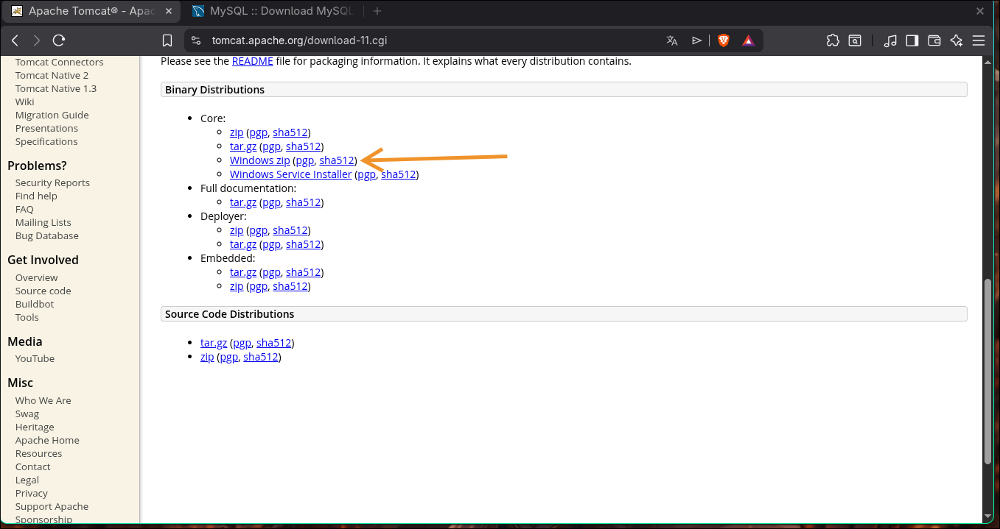
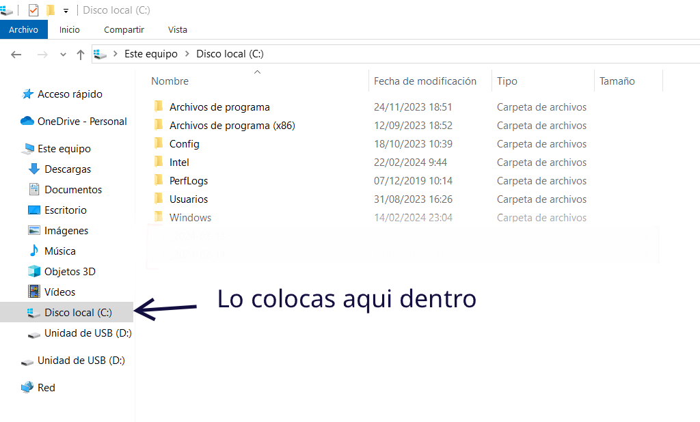
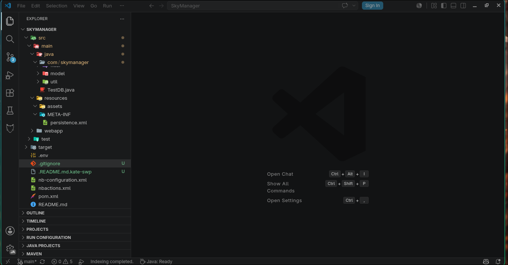
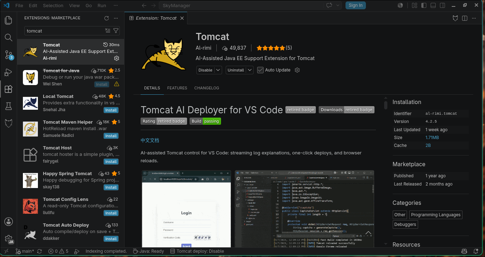
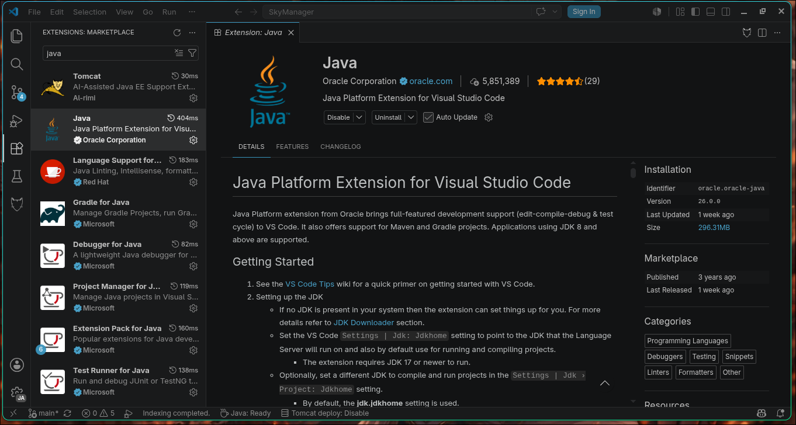

# sky-manager
# ! ABRIR CON VSCODE
## Instalación del proyecto 
---
### Requsitos:
- MySQL(https://dev.mysql.com/downloads/installer/)
- JDK 21 (https://www.oracle.com/java/technologies/javase/jdk21-archive-downloads.html)
- Tomcat 11 (https://tomcat.apache.org/download-11.cgi)
---
### Instalacion de tomcat
- Entra a la web https://tomcat.apache.org/download-11.cgi
Y descarga el archivo **WINDOWS.ZIP**

- Luego cen descargas descomprime el archivo para luego clocarlo en disco local `**C:**`, en la raiz de tu PC

---
### Abrir con vscode
Al abrir `**VSCODE**` junto con el proyecto 

**Instalar las extensiones:**
- Tomcat
- Java (PREVIAMENTE DEBISTE INSTALAR JDK21)

**TOMCAT:**

**JAVA**

## Ejecutar script de la base de datos 

## configurar archivo .env para que logre funcionar

